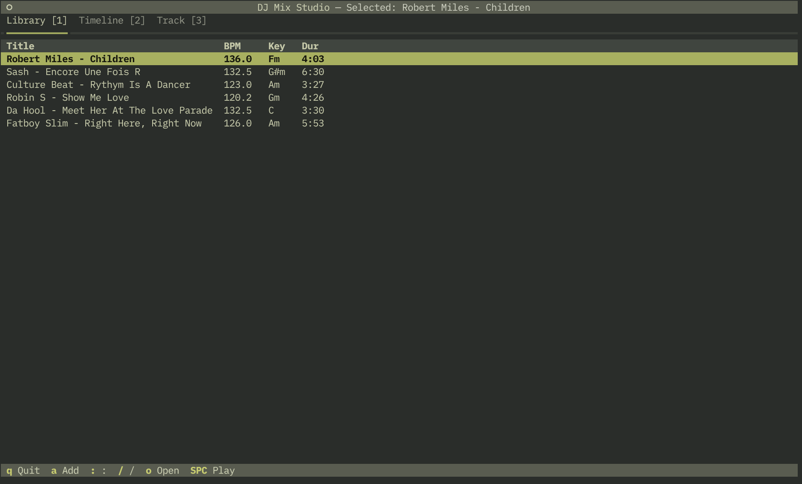

# PyMixter

> **Super early alpha** — expect breaking changes, missing features, and rough edges.

Terminal-based DJ mix studio. Analyze tracks, build playlists, automix by key/BPM, play with real-time EQ — all from the terminal.



## Features

- **TUI** — Textual-based interface with library, timeline, track info
- **Audio analysis** — BPM, key detection, beat grid, cue points, energy profile (librosa)
- **Automix** — automatic track ordering by harmonic compatibility (Camelot wheel) and BPM
- **Playback** — dual-deck player with 3-band EQ, gain, limiter (pedalboard + sounddevice)
- **Rekordbox XML** — import/export for interop with Rekordbox, Mixxx, Traktor, Serato
- **CLI** — full command-line interface for scripting and automation

## Quick start

```bash
uv run python main.py                    # launch TUI
uv run python main.py cli scan ~/Music --analyze   # import + analyze
uv run python main.py cli automix        # auto-arrange by key/BPM
uv run python main.py cli export         # export to Rekordbox XML
```

## TUI keys

| Key | Action |
|-----|--------|
| `Space` | Play / pause |
| `[` `]` | Seek -5s / +5s |
| `x` | Stop |
| `o` | Open file browser |
| `a` | Add selected track to timeline |
| `/` | Fuzzy search library |
| `:` | Command console |
| `l` | Open recent project |
| `1` `2` `3` | Switch tabs |
| `q` | Quit |

## Console commands (`:`)

`add <file>` `scan <dir>` `analyze [idx]` `automix` `render [output.wav]` `validate` `playmix` `preview <pos>` `export` `import <file.xml>` `open <file>` `suggest` `save` `help`

### Mixing

`deckb <idx>` `xfader <0-1>` `eq low|mid|high <dB>` `gain <dB>` `bpm set|halve|double|nudge|key` `stems [idx]` `cue in|out <sec>`

## Using with Claude Code

PyMixter is designed to be driven by AI agents. Claude Code can control the project via CLI, observe the TUI through tmux, and compose mixes autonomously.

### CLI workflow (recommended for agents)

```bash
# Import and analyze a music folder
uv run python main.py cli scan ~/Music/edm --analyze

# Check what we have
uv run python main.py cli library

# Auto-arrange into a mix (orders by key compatibility + BPM)
uv run python main.py cli automix

# View the result
uv run python main.py cli timeline show

# Export for other DJ software
uv run python main.py cli export -o my_mix.xml
```

### Observing the TUI via tmux

Claude Code can launch the TUI in a tmux session and observe it like a screenshot:

```bash
# Start TUI in background tmux session
tmux new-session -d -s mix -x 56 -y 30
tmux send-keys -t mix 'uv run python main.py' Enter

# "Screenshot" the terminal at any time
tmux capture-pane -t mix -p

# Send keystrokes
tmux send-keys -t mix Space        # play/pause
tmux send-keys -t mix ':' && tmux send-keys -t mix 'automix' Enter

# Close
tmux send-keys -t mix 'q'
```

This lets Claude Code interact with the TUI the same way a human would — seeing the screen, pressing keys, and verifying results.

## Requirements

- Python 3.13+
- System: `libsndfile`, `portaudio` (for audio playback)

## License

AGPL-3.0-or-later
